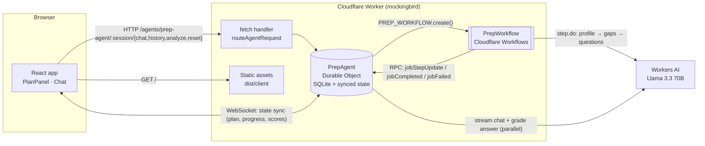

# Mockingbird: AI interview prep on Cloudflare

**Live demo:** https://mockingbird.palakmathur2811.workers.dev. Click **Use a sample → Build prep plan** to try it in about 30 seconds.

AI prompt history: [`PROMPTS.md`](PROMPTS.md).

Paste a job description. A **durable, multi-step agent workflow** reads it, maps your skill gaps and writes a tailored question bank. It then runs a **mock interview** that streams feedback and **grades every answer**. Your plan, scores and conversation persist in your own Durable Object, so you can refresh or come back later and pick up where you left off.

Built with **Workers AI (Llama 3.3 70B)**, the **Cloudflare Agents SDK** (Durable Objects + SQLite), **Cloudflare Workflows** and a **React** frontend served from the same Worker.

---

## Features

| Feature | What happens |
|---|---|
| **Prep-plan workflow** | A 4-step Cloudflare Workflow: role profile → gap analysis → question bank → save. Each step is checkpointed and retried with exponential backoff. Progress streams live to the UI. |
| **Mock interview chat** | Llama 3.3 plays the interviewer. Its system prompt is built from the saved plan, the current question and your scores so far. Replies stream token by token. |
| **Answer grading** | Every answer is graded (1–5, strengths, improvements) by a second, JSON-mode LLM call that runs **in parallel** with the streamed reply. A good answer moves the interview to the next question; hints and small talk score 0 and don't. |
| **Memory** | Chat history is stored in Durable Object SQLite. The plan, workflow progress and scores are stored in Agent state, which is persisted and synced to clients over WebSocket. |
| **Resilience** | Input validation on client and server, model-output validation with a fallback call, retries, rollback on a failed chat turn, a Retry button, and duplicate-run protection. |
| **UX** | Responsive (desktop two-pane, mobile tabs), light/dark themes, empty/loading/error states, keyboard shortcuts, a one-click sample, reduced-motion support. |

## Assignment requirement mapping

| Requirement | Implementation | Where |
|---|---|---|
| **LLM** | `@cf/meta/llama-3.3-70b-instruct-fp8-fast` on Workers AI: streamed chat, JSON-schema mode for structured steps and grading | `src/server/llm.ts`, `src/server/prompts.ts` |
| **Workflow / coordination** | `PrepWorkflow` (Cloudflare Workflows) runs 4 retried steps and calls the agent over Durable Object RPC to report progress. The agent coordinates chat, grading and state. | `src/server/workflow.ts`, `src/server/agent.ts` |
| **User input (chat)** | React chat UI with streaming, served as Worker static assets | `src/client/*` |
| **Memory / state** | Agents SDK `setState` (persisted and synced over WebSocket) plus SQLite `messages` table in the Durable Object. Restored after refresh; used as LLM context. "Start over" clears it. | `src/server/agent.ts` |

## Architecture



### Data flow

1. **Session.** The browser creates a random session id (in `localStorage`). It names the user's `PrepAgent` Durable Object, so each user gets an isolated agent with its own SQLite database.
2. **Build a plan.** `POST /analyze` validates the input and calls `env.PREP_WORKFLOW.create()`. The agent marks the job `running` and `setState` pushes that to the UI.
3. **Workflow.** Each LLM step is a `step.do` with `retries: 3, backoff: exponential`. Output is validated (`validate.ts`); if the shape is wrong, the step throws and gets retried. Between steps the workflow calls the agent over **Durable Object RPC** (`getAgentByName(...).jobStepUpdate()`), so progress appears live. On completion the agent stores the plan, clears the old chat and posts question 1. On final failure it records a readable error.
4. **Interview.** `POST /chat` saves the user message, builds context (a system prompt from the plan and state plus the last 16 messages) and streams Llama's reply back. At the same time a grading call scores the answer. When both finish, the agent saves the reply and the grade and advances `currentQuestion`. The new state is pushed to the UI.
5. **Refresh.** On load, the UI fetches `/history` (SQLite) and the WebSocket delivers current state. The workflow keeps running whether or not the browser is open.

### Key design decisions

- **One Durable Object per user (Agents SDK).** Strongly consistent, single-threaded state per session with built-in SQLite, and no external database to provision. State sync over WebSocket gives live progress without polling.
- **Workflows for plan generation, not a single request.** Three sequential LLM calls take about 30s and can fail independently. Workflows checkpoint each step, so a failure in step 3 doesn't redo steps 1–2, and the run survives browser refreshes.
- **Workflow → agent via RPC, and stale runs are ignored.** Each update carries the workflow `instanceId`. The agent drops updates from superseded runs, so "Start over" mid-run is safe.
- **Grading in parallel with streaming.** The reply streams immediately and the grade arrives about 1s later over the state sync. The user never waits for grading.
- **Don't trust model output.** JSON-schema mode plus runtime validators. Schema-constrained decoding sometimes collapsed to empty arrays in testing, so the schemas use `minItems`, and there's a free-form fallback before the step retries. User text is wrapped as data, and the prompts tell the model to ignore instructions inside it (basic prompt-injection hygiene).
- **Safe rendering.** Model markdown is rendered with a tiny React renderer (bold, lists, paragraphs). There is no `innerHTML`, so there's no XSS path from model output.

## Project structure

```
src/
  server/
    index.ts       Worker entry: routeAgentRequest + /api/health; exports DO + Workflow classes
    agent.ts       PrepAgent (Agents SDK): HTTP routes, SQLite history, chat streaming, grading, RPC for the workflow
    workflow.ts    PrepWorkflow: 4 durable steps with retries + failure reporting
    llm.ts         Workers AI wrapper: model id, JSON mode, free-form fallback, SSE stream parsing
    prompts.ts     All system prompts + JSON schemas
    validate.ts    Normalises/validates model output (throws → retry)
  shared/types.ts  Types shared by server and client (state, plan, messages, limits)
  client/
    App.tsx        Shell, WebSocket state sync (useAgent), history loading, tabs, reset
    PlanPanel.tsx  Plan form, live workflow progress, plan view (competencies, gaps, questions)
    Chat.tsx       Streaming chat, grades, quick replies, error/retry, empty state
    Markdown.tsx   Safe markdown renderer
    api.ts         HTTP client + stream reader, session id
    sample.ts      Sample job description for demos
    styles.css     Design tokens, light/dark, responsive layout
tests/validate.test.ts   Unit tests for JSON extraction and validators
wrangler.jsonc   Bindings: AI, Durable Object (SQLite migration), Workflow, assets
```

## Local development

Prerequisites: Node.js 20+ and a Cloudflare account (the free plan works). Workers AI **always runs on Cloudflare**, even in local dev, so you must be logged in, and local AI calls count toward your Workers AI usage.

```bash
npm install
npx wrangler login     # one-time: opens the browser and you click "Allow"
npm run dev            # http://localhost:5173
```

Other commands:

```bash
npm test               # unit tests (Vitest)
npm run typecheck      # TypeScript
npm run build          # production build → dist/
npm run cf-typegen     # regenerate worker-configuration.d.ts after changing wrangler.jsonc
```

**No secrets or environment variables are required.** The only credential is your Wrangler login (an OAuth token stored by Wrangler on your machine). For CI, use a `CLOUDFLARE_API_TOKEN` environment variable with the *Edit Cloudflare Workers* template plus *Workers AI* permissions, and never commit it.

## Deployment

```bash
npx wrangler login     # if not already logged in
npm run deploy         # vite build && wrangler deploy
```

Wrangler prints the URL, e.g. `https://mockingbird.<your-subdomain>.workers.dev`. On first deploy it creates the Durable Object class (SQLite migration `v1`) and registers the `prep-workflow` Workflow. No dashboard setup is needed, unless your account doesn't have a `workers.dev` subdomain yet: then Wrangler prompts you to choose one, or you can set it under **Workers & Pages → Settings**.

### Verify the deployment

1. `curl https://mockingbird.<sub>.workers.dev/api/health` → `{"ok":true}`
2. Open the URL, click **Use a sample → Build prep plan**, and watch the 4 steps complete (~30s).
3. Answer question 1. The reply streams and a score appears under your answer.
4. Refresh the page. The plan, chat and score should still be there.
5. Dashboard: **Workers & Pages → mockingbird** (logs via Observability), **Workflows → prep-workflow** (each run and step), **AI → Workers AI** (usage).

### Troubleshooting

| Symptom | Fix |
|---|---|
| `npm run dev` fails with *CLOUDFLARE_API_TOKEN… non-interactive* | Run `npx wrangler login` first (AI binding needs auth even locally). |
| Plan fails at a step ("unusable output after several retries") | Transient model issue: click **Build prep plan** again. See the `unusable … output` lines in `wrangler tail` / dev logs. |
| Chat shows "reply was interrupted" | Network drop or the dev server hot-reloaded mid-reply. Click **Retry**; the server already rolled back the partial turn. |
| `Durable Object … migration` error on deploy | Don't rename `PrepAgent` or edit the `v1` migration; add a new migration tag instead. |
| Workers AI `4006` / quota errors | Free daily neuron allocation used up; wait for the reset or enable Workers Paid. |
| Status dot says "Connecting" | WebSocket blocked (corporate proxy/extension). HTTP features still work; state refreshes on reload. |
| Live logs | `npx wrangler tail mockingbird` |

## Test results

Run on 2026-09-21 against real Workers AI via `npm run dev`.

**Passed**
- `tsc --noEmit`: no type errors. `vite build`: OK. `wrangler deploy --dry-run`: bundles, 3 bindings detected, 422 KB gzipped.
- Unit tests: 7/7 (JSON extraction from fenced/chatty output, truncation, validator normalisation, clamping, rejection → retry).
- API validation: empty message → 400, malformed JSON body → 400, job description under 80 chars → 400, unknown route → 404, second `/analyze` while running → 409.
- Real LLM chat: streamed reply from Llama 3.3; user and assistant messages persisted in SQLite.
- Workflow end-to-end: 4 successful runs (~30–36s). Progress updated live in the UI. **A page refresh mid-run restored progress** and the run finished.
- Workflow failure path: before the fix, gap analysis returned `{"gaps":[]}` 4 times; retries ran out, the step showed as failed and the UI got a readable error. After adding `minItems` + fallback, the same input passed 2/2 times.
- Interview: an answer was graded 5/5 and shown under the message; the stats changed to 1/6 via WebSocket; the next question was asked. A hint request did **not** advance the interview or add a score.
- Persistence: after a refresh, all messages, the grade and the stats were restored.
- Upstream failure: a Workers AI connection dropped mid-chat (dev hot reload). The server logged it and **rolled back the user message** (verified via `/history`).
- Client network failure (injected): error banner shown, text kept in the input, Retry sent it successfully.
- Start over: plan, chat and scores cleared, and the reset persists after refresh.
- Empty-form submit shows inline validation. Mobile (375px): tabbed layout, no horizontal overflow, 16px gutters. No browser console errors.

**Production (deployed 2026-09-21 to `mockingbird.palakmathur2811.workers.dev`)**
- `/api/health` → `{"ok":true}`, home page 200, empty message → 400.
- Chat: 5/5 streamed replies from Llama 3.3. The very first request right after deploy returned Cloudflare `error code: 1042` once and did not happen again. It's likely a transient during version rollout.
- Workflow: a plan was built end to end in about 24s, both via the API and in the browser. The WebSocket connected ("Synced"), with no console errors.
- **Bug found in production and fixed:** the plan finished but question 1 didn't appear until a refresh. Cause: overlapping `/history` requests resolved out of order, and an older empty response overwrote the newer one. Fix: only the newest request may update the UI (a request-counter guard), plus `cache: no-store`. After redeploying, the plan and question 1 appear together, and an answer was graded 5/5 with stats updated live.

**Not run / limitations**
- No automated integration/E2E suite; the flows above were tested manually in the browser and with curl.
- Light theme was implemented but only the dark theme (the test machine's setting) was visually checked.
- **No authentication.** A session is an unguessable UUID in `localStorage`, so clearing browser storage starts a new session and sessions don't sync across devices. Fine for a demo; production would add auth (e.g. Cloudflare Access) and rate limiting.
- LLM quality varies: grading is a model judgement and occasionally generous. Answers are typed; voice input is a possible extension (Agents SDK voice / Realtime).

## Possible extensions

Voice answers (Workers AI speech-to-text), rate limiting via the Rate Limiting binding, a scheduled daily-practice reminder (`this.schedule`), exporting a PDF report, and multiple saved plans per user.
